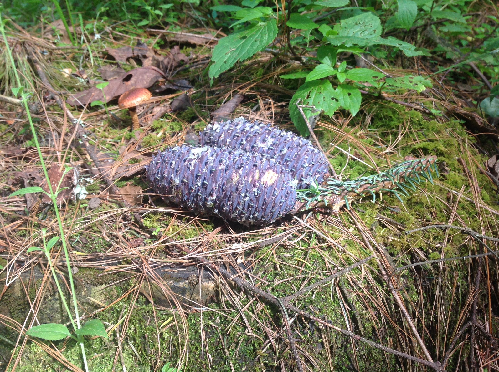
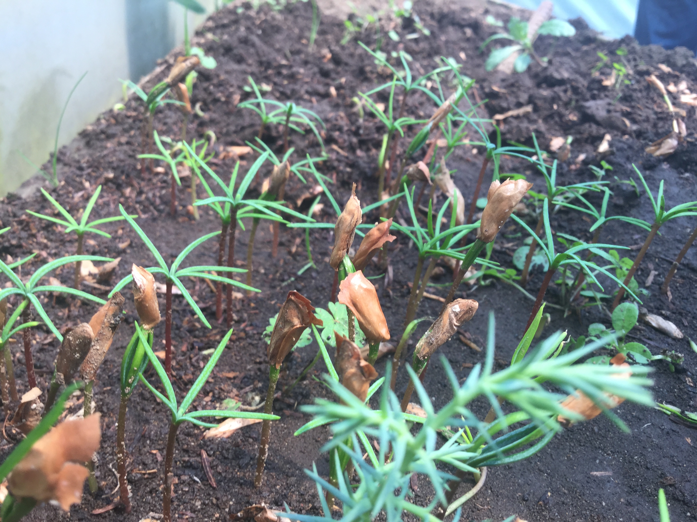
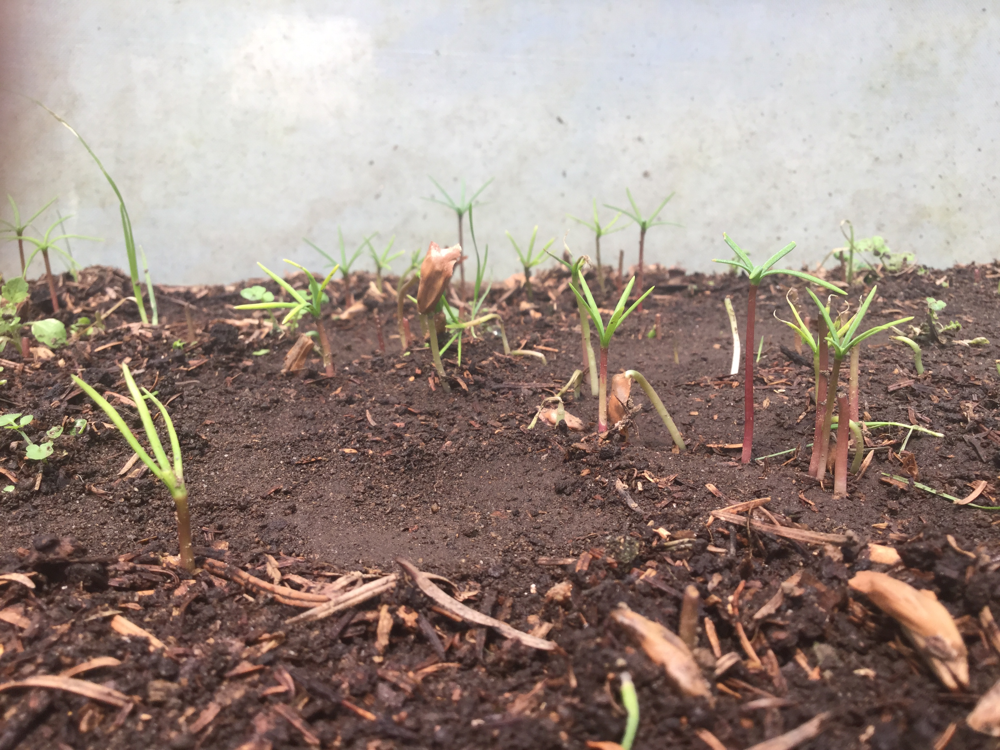

# Obtención de megagametofitos en *Abies religiosa*

La presencia de conos ocurre desde octubre, pero se recomienda colectarlos entre enero y febrero. Se recomiendan estas fechas porque es posible obtener un mayor número de embriones maduros.

La mejor calidad de las semillas se encuentra en la parte media del cono, por lo que se sugiere colectar conos anchos y grandes (Nieto de Pascual, 2004).

En promedio un cono tiene 380 semillas.

Imagen: Nevado de Toluca, 2017.

## Almacenamiento del germoplasma

+ Los conos deben secarse, posiblemente con luz solar.
+ Se recomienda secar por 50 días, pero puede depender de las características ambientales.
+ **Desalado**: retirar el ala de las semillas. Puede ser manualmente en húmedo o mecánicamente en seco.
+ Para mantener la viabilidad de las semillas en especies como *A. gradis*, se recomienda que las semillas se almacenen en **5 - 8°C**.
+ CONAFOR recomienda su almacenamiento a temperaturas de entre **4 y 5°C**.

## Tratamiento pre-germinativo

+ **Desinfección:** Sumergirlas en una solución de H2O2 al 30% [(Álvarez-Moctezuma *et al*., 2007)](http://www.redalyc.org/articulo.oa?id=62914102). Alternativamente, las semillas se pueden desinfectar en una solución de cloro al 1% por 30 minutos (Alarcón, *comentarios personales*).

+ **Inbibición:** Sumergir las semillas en agua potable o agua destilada por 20 hrs. Posteriormente, secarlas a temperatura ambiente, con aire (en una cámara de flujo laminar) por 3 hrs.

+ **Viabilidad:** En un vaso de precipitados con agua potable, depositar las semillas. Mantener el vaso de precipitados a 2-4°C por 20 horas. Al término de este periodo, se esperan dos capas de semillas, las viables (en el fondo del vaso) y las inviables (flotando). Si estas capas no se forman, se secan las semillas por 3 hrs. y se repite el procedimiento. Las semillas se vuelven a desinfectar, enjuagar y secar.

+ **Estratificación:**
Método a) Mantener las semillas a temperaturas de 1 a 5 °C por un periodo de 14 a 28 días (Patiño *et al*., 1983). Se espera un porcentaje de germinación del 70%. Las semillas deben estar húmedas (pero evitar gotas de agua) en bolsas de plástico, perforadas por una aguja.
Método b) Las semillas deben remojarse en agua de coco por **7 días** (Patiño *et al*., 1983). Con este método, se espera un % de germinación del 96.8.

## Germinación

+ Las semillas deben estar en humedad (papel filtro o agar) y a un control de temperatura de 20°C por 16 hrs. y 30°C por 8 hrs (ISTA, 2011). Se estima que la emergencia de la radícula empieza entre el 7 y 14 día después de la germinación.

Imagen: Vivero Xochiac, Desierto de los Leones, 2018.

Imagen: "Cerillos", Vivero de Xochiac, Desierto de los Leones, 2018.

Cuando la planta esta desprendiendose de la semilla se le llama "cerillo", ya que asemeja esta forma.
